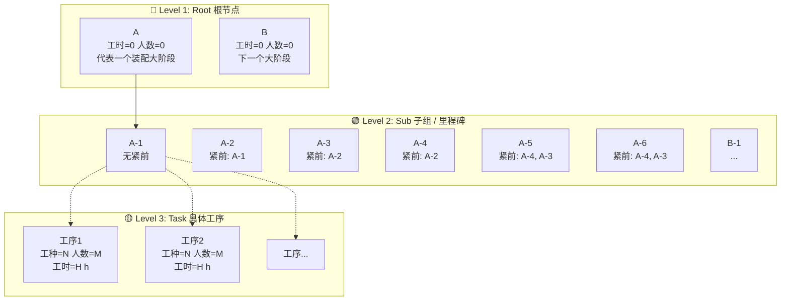
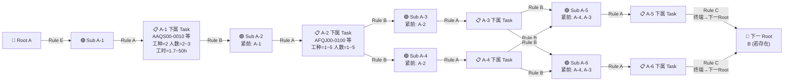
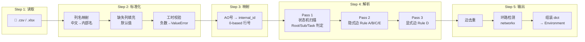
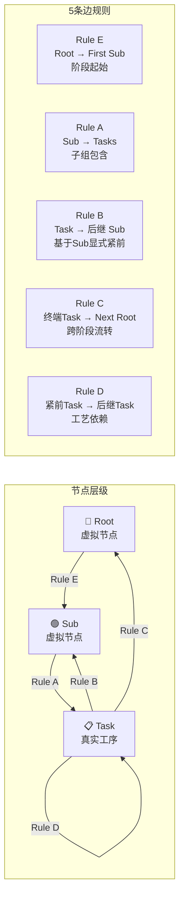

# DATASET 数据集规范与数据加载器说明

> **文件**: `data_loader.py`  
> **路径**: `d:/.../Dynamic_APAL_RL_v2-重构版/data_loader.py`  
> **最后更新**: 2026-05-17

---

## 目录

1. [概述](#1-概述)
2. [依赖环境](#2-依赖环境)
3. [数据集文件格式](#3-数据集文件格式)
4. [拓扑层级结构定义](#4-拓扑层级结构定义)
5. [数据加载器详解](#5-数据加载器详解)
6. [边构建规则 (5 条 Rule)](#6-边构建规则-5-条-rule)
7. [列名标准化机制](#7-列名标准化机制)
8. [异常处理方案](#8-异常处理方案)
9. [返回值契约](#9-返回值契约)
10. [调用示例与验证](#10-调用示例与验证)
11. [合成数据集生成](#11-合成数据集生成)

---

## 1. 概述

`data_loader.py` 是本项目中唯一的数据集读取入口。它负责：

- 读取 `.csv` 或 `.xlsx` 格式的飞机脉动装配线工序数据
- 自动解析工序的层级拓扑结构（Root → Sub → Task）
- 构建完整的 **有向无环图 (DAG)** 边集
- 列名自动标准化（中英文兼容）
- 环路检测与数据校验

**所有环境实例 (`AirLineEnv_Graph`) 只通过此模块获取图骨架数据。**

---

## 2. 依赖环境

| 包名 | 最低版本 | 用途 |
|------|---------|------|
| `pandas` | ≥2.0 | CSV/Excel 读取与数据表操作 |
| `torch` | ≥2.0.0 | 张量化输出 |
| `numpy` | ≥1.24 | 数值运算 |
| `networkx` | ≥3.0 | 拓扑环路检测 (DAG 校验) |
| `openpyxl` | ≥3.1 | `.xlsx` 文件读取支持 |

全部依赖已列入项目根目录 `requirements.txt`。

---

## 3. 数据集文件格式

### 3.1 CSV 列定义

| 列名 (中文) | 别名 (英文) | 数据类型 | 是否必填 | 说明 |
|------------|------------|---------|---------|------|
| `AO号` | `TaskID`, `ID`, `工序号` | `str` | **是** | 工序唯一标识，格式决定层级归属 |
| `类型` | `Skill_Type`, `Type`, `工种` | `int` (0~9) | 否，默认 0 | 技能类型编号，决定所需工人技能匹配 |
| `紧前工序AO号` | `Predecessors`, `Preds`, `紧前工序` | `str` (逗号分隔) | 否 | 显式指定的前置工序 AO号，支持逗号 `,` / 分号 `;` / 中文顿号 `、` |
| `需求人数` | `Demand_Workers`, `Req_Workers` | `int` (≥1) | 否，默认 1 | 该工序最少需要的工人数 |
| `加工时间/h` | `Duration`, `Time`, `工时` | `float` (≥0) | 否 | 该工序的标准加工时间，**单位：小时** |
| `限定站位` | `Fixed_Station` | `int` | 否 | 强制绑定的站位编号 (1-based)，为空表示不限定 |
| `部位容量` | — | 任意 | 否 | 当前项目**未使用**，保留字段 |

### 3.2 AO号 与层级判定规则

每个工序行的 `AO号` 字段通过纯启发式规则自动判定层级：

| AO号 示例 | 判定层级 | 判定规则 |
|----------|:------:|---------|
| `A`, `B` | **Root (根节点)** | 纯字母，不含 `-` |
| `A-1`, `A-2`, `B-1` | **Sub (子组/里程碑)** | `字母-数字` 格式，`-` 前为英语字母、`-` 后为纯数字 |
| `AAQS00-0010` | **Task (普通工序)** | 其他所有格式 |

> **关键约束**：所有非 Root/Sub 类型的行都会挂在当前最近出现的 Sub 节点下。

> **Sub 与 Root 同样拥有 `紧前工序AO号` 字段**：这个字段在 Sub 和 Root 行上定义了它们之间的显式依赖关系。

### 3.3 数据示例

```csv
序号,AO号,类型,紧前工序AO号,需求人数,加工时间/h,限定站位,部位容量
1,A,1,,0,0,,
2,A-1,1,,0,0,,
3,A-2,1,A-1,0,0,,
4,AAQS00-0010,2,,2,1.7,1,6
5,FAQJ00-3450,2,,2,2.9,1,
6,FDQJ00-2000,2,FAQJ00-3450,2,2.1,1,
7,A-3,1,A-2,0,0,,
8,A-4,1,A-2,0,0,,
```

解读：
- 第 1 行 `A` → Root 节点（工时为 0，需求人数为 0）
- 第 2 行 `A-1` → Sub 节点，无紧前（Root 的第一个子组，自动起始）
- 第 3 行 `A-2` → Sub 节点，**紧前为 A-1**（A-1 完成后才能开始 A-2）
- 第 7 行 `A-3` → Sub 节点，**紧前为 A-2**
- 第 8 行 `A-4` → Sub 节点，**紧前也是 A-2**（A-3 和 A-4 **并行**）
- 第 4~6 行 → Task，挂在 A-1 或 A-2 下

---

## 4. 拓扑层级结构定义

### 4.1 三级层级结构图



> **说明**：Root 和 Sub 是虚拟节点（工时为 0、需求人数为 0），仅起拓扑组织作用；Task 是真实工序节点，包含工种、人数需求、工时等属性。每个 Sub 下可挂任意数量 Task。

### 4.2 Sub 层级并行分支拓扑图

飞机脉动线是**单向流动**的，工序在站位上不能回退。Sub 之间的依赖由 `紧前工序AO号` 字段显式定义，**支持并行分支**。

> **以下拓扑以 283.csv 真实数据绘制**，A-3 和 A-4 均以 A-2 为紧前，形成并行分支；A-5 和 A-6 均以 "A-4,A-3" 为紧前，形成归并→再分叉结构。



> **拓扑解读**：
> - **A-3 与 A-4 并行**：A-2 完成后，A-3 和 A-4 可同时开始
> - **A-5 与 A-6 归并→再分叉**：A-5 的紧前为 "A-4,A-3"，意味着 A-3 **且** A-4 都完成后 A-5 才能开始；A-6 同理
> - **终端 Sub**：A-5 和 A-6 无 Sub 后继，其所有 Task 完成后流向下一 Root
> - **Rule D（显式紧前）**：Task 之间的工艺依赖（如 FDQJ00-2000 ← FAQJ00-3450）在图中的 Task 组内部生效

### 4.3 层级依赖关键规则

| 规则 | 说明 |
|------|------|
| Sub 紧前由 `紧前工序AO号` 显式定义 | 例如 A-4 的紧前为 A-2，A-5 的紧前为 "A-4,A-3" |
| 多个 Sub 可共享同一紧前 | **支持并行分支** |
| Task 流向由所属 Sub 的显式后继决定 | 路径完全由 Sub 紧前字段定义 |
| 终端 Sub 的 Task 流向下一个 Root | 严格单向，不跨 Root 回退 |
| 工序不能回退 | 一旦进入某站位，后续任务只能延续或前进 |

---

## 5. 数据加载器详解

### 5.1 函数签名

```python
def load_data(file_path: str) -> dict:
```

| 参数 | 类型 | 说明 |
|------|------|------|
| `file_path` | `str` | 数据文件的绝对或相对路径，支持 `.csv` 和 `.xlsx` |

### 5.2 处理流程 (5 步)



```
Step 1: 读取原始文件
   ├─ .csv → pd.read_csv()
   └─ .xlsx → pd.read_excel()

Step 2: 列名标准化
   ├─ 中文/英文列名 → 统一为内部名称 (task_id, duration, skill_type...)
   ├─ 缺失列 → 填充默认值
   └─ 工时合法性校验 → 负数则抛 ValueError

Step 3: ID 映射
   └─ 基于 DataFrame 行号生成 internal_id (0-based)
       id_map: {"AAQS00-0010" → 2, "FAQJ00-3450" → 3, ...}

Step 4: 状态机解析 (3 Pass)
   ├─ Pass 1: 扫描所有行，识别 Root / Sub / Task
   │   根据 AO号 格式进行启发式判定
   │   维护 current_root 和 current_sub 状态指针
   ├─ Pass 2: 构建隐式边 (Rule A/B/C/E)
   └─ Pass 3: 构建显式边 (Rule D / 紧前工序)

Step 5: 校验与输出
   ├─ 边去重
   ├─ networkx 环路检测
   └─ 组装返回值字典
```

### 5.3 状态机详解

脚本维护两个状态指针：

| 变量 | 更新条件 | 重置条件 |
|------|---------|---------|
| `current_root` | 遇到 Root 行 | 遇到下一个 Root 行时覆盖 |
| `current_sub` | 遇到 Sub 行 | 遇到下一个 Sub 行或 Root 行时覆盖 |

每遇到一个 Task 行，就将其 `internal_id` 添加到 `tasks_in_sub[current_sub]` 列表中。

---

## 6. 边构建规则 (5 条 Rule)

构建的有向边 `(src_id, dst_id)` 表示"src 必须先于 dst 完成"。

### Rule E: Root → First Sub

每个 Root 连接到其第一个 Sub，保证进入该 Root 阶段时从第一个子组开始。

```
A → A-1
B → B-1
```

### Rule A: Sub → Tasks

每个 Sub 指向其包含的所有 Task。

```
A-1 → AAQS00-0010
A-1 → FAQJ00-3450
A-1 → ...
```

### Rule B: Task → 后继 Sub（基于 Sub 显式紧前关系）

某个 Sub 的所有 Task 完成后，流向该 Sub 的**所有后继 Sub**（由后继 Sub 行自身的 `紧前工序AO号` 决定）。

```
A-2 的后继 Sub 有 A-3 和 A-4（因为二者都声明紧前=A-2）:
  A-2 的所有 Task → A-3
  A-2 的所有 Task → A-4
```

**算法**：脚本先扫描所有 Sub 的 `紧前工序AO号` 列，构建 Sub 后继映射表。例如：

| Sub | 紧前 | 后继 Sub |
|-----|------|---------|
| A-1 | (无) | A-2 |
| A-2 | A-1 | A-3, A-4 |
| A-3 | A-2 | A-5, A-6 |
| A-4 | A-2 | A-5, A-6 |
| A-5 | A-4, A-3 | (终端 → 下一 Root) |
| A-6 | A-4, A-3 | (终端 → 下一 Root) |

### Rule C: 终端 Sub Tasks → Next Root (跨 Root 流转)

无 Sub 后继的"终端子组"的所有 Task 完成后，流向下一个 Root。Root 之间仍然是严格单向流动的。

```
A-5 和 A-6 都是终端 Sub，它们的 Task 都完成 → 流向 B:
  A-5 Task[...] → B
  A-6 Task[...] → B
```

> **注**：如果 Sub 没有显式紧前字段（如旧数据集），加载器会自动回退到顺序规则（CSV 出现顺序）。

### Rule D: 显式紧前工序

CSV 中 `紧前工序AO号` 列指定的工序间依赖。

```
FDQJ00-2000 的紧前工序是 FAQJ00-3450 → 生成边:
  FAQJ00-3450 → FDQJ00-2000
```

**处理逻辑**：
- 支持多种分隔符：逗号 `,`、中文逗号 `，`、分号 `;`
- 自动处理 `.0` 后缀（如 Excel 导出的 `3450.0` 会规范化为 `3450`）
- 跳过空值、`nan`、`none`、`0`
- 如果指定的紧前工序在 `id_map` 中找不到，**静默跳过**（不报错）

---

## 7. 列名标准化机制

### 7.1 多语言映射表

```python
col_candidates = {
    'task_id':         ['工序号', 'TaskID', 'id', 'Task_ID', 'ID', 'AO号'],
    'duration':        ['装配时间', 'Duration', '工时', 'Time', 'Duration_Time', '加工时间/h'],
    'predecessors':    ['紧前工序', 'Predecessors', 'Preds', 'Predecessor_IDs', '紧前工序AO号'],
    'skill_type':      ['工种', 'Skill', 'Skill_Type', 'Type', '类型'],
    'fixed_station':   ['限定站位', 'Fixed_Station', 'Station_Constraint'],
    'demand_workers':  ['需求人数', 'Demand_Workers', 'Workers_Required', 'Req_Workers'],
}
```

匹配策略：遍历每个内部名称的候选列表，取 DataFrame 中第一个匹配上的列名。

### 7.2 默认值回退

| 内部列名 | 缺失时的默认值 |
|---------|-------------|
| `skill_type` | `0` |
| `demand_workers` | `1` (且 fillna 为 1) |
| `fixed_station` | `np.nan` (表示不限定) |
| `duration` | **不设默认值**（必须有这一列） |

---

## 8. 异常处理方案

### 8.1 FileNotFoundError

**条件**: 文件路径不存在。

**抛出**: `FileNotFoundError(f"Data file not found: {file_path}")`

**处理方式**: 检查路径是否正确、文件是否存在。

### 8.2 工时为负数 (ValueError)

**条件**: `duration` 列中存在负数。

**抛出**: `ValueError("数据错误：以下工序的工时为负数，请检查数据集！{invalid_tasks}")`

**检测代码**:
```python
if (df['duration'] < 0).any():
    invalid_tasks = df[df['duration'] < 0]['task_id'].tolist()
    raise ValueError(...)
```

### 8.3 拓扑环路 (ValueError)

**条件**: 构建的有向图中存在循环依赖。

**抛出**: `ValueError("数据错误：发现工艺路线存在循环依赖...")`

**检测方式**: 使用 `networkx.find_cycle()`，若存在环则抛出。

**典型场景**: 
- 紧前工序中 A → B 且 B → A
- 隐式边 Rule B/Rule C 与显式边 Rule D 形成闭环

### 8.4 边界条件处理

| 场景 | 行为 |
|------|------|
| Root 下无 Sub | 不生成 Rule E 边，不影响其他逻辑 |
| Sub 下无 Task (纯里程碑) | Sub 自身直接连向后继 Sub，不产生 Task→Sub 边 |
| `紧前工序AO号` 为空 / "0" / NaN | 跳过该行的显式边处理 |
| 紧前工序 AO号 在 id_map 中找不到 | **静默跳过**，不报错也不警告 |
| demand_workers 中有 NaN | 自动 fillna(1) |
| 工人需求人数为 0 | `environment.py` 中会用 `clamp(min=1)` 强制修正 |

---

## 9. 返回值契约

```python
{
    'task_df':          pd.DataFrame,    # 完整的工序宽表，含 internal_id 列
    'precedence_edges': torch.Tensor,    # shape [2, E], dtype=torch.long
                                         # edges[0,:] 是 src 节点 internal_id
                                         # edges[1,:] 是 dst 节点 internal_id
    'num_tasks':        int,             # 总节点数 (含 Root + Sub + Task)
    'id_map':           dict,            # {"AO号字符串" → internal_id}
}
```

### 9.1 下游消费方

`environment.py` 中的 `AirLineEnv_Graph` 是唯一消费方：

```python
raw_data = load_data(file_path)
# 使用 raw_data['task_df']      → 获取工序属性
# 使用 raw_data['precedence_edges'] → 构建 GNN 拓扑边
# 使用 raw_data['num_tasks']   → 确定任务空间大小
```

---

## 10. 调用示例与验证

### 10.1 基本调用

```python
from data_loader import load_data

data = load_data("data/283.csv")

print(f"任务总数: {data['num_tasks']}")
print(f"边矩阵形状: {data['precedence_edges'].shape}")  # [2, E]
print(f"ID映射条目: {len(data['id_map'])}")
```

### 10.2 验证数据集完整性

```python
from data_loader import load_data
import torch

data = load_data("data/680.csv")

# 验证 1: 节点数一致
assert data['num_tasks'] == len(data['task_df'])
print("✓ num_tasks 一致")

# 验证 2: 所有 internal_id 唯一
assert data['task_df']['internal_id'].is_unique
print("✓ internal_id 唯一")

# 验证 3: 边索引范围合法
edges = data['precedence_edges']
assert edges.min() >= 0
assert edges.max() < data['num_tasks']
print(f"✓ 边索引在 [0, {data['num_tasks']}) 范围内")

# 验证 4: 无自环
assert not (edges[0] == edges[1]).any().item()
print("✓ 无自环")

# 验证 5: 无重复边
unique_edges = set()
for i in range(edges.shape[1]):
    unique_edges.add((edges[0, i].item(), edges[1, i].item()))
assert len(unique_edges) == edges.shape[1]
print(f"✓ 无重复边 (共 {len(unique_edges)} 条)")

# 验证 6: skill_type 在 [0,9] 之间
skill_types = data['task_df']['skill_type'].dropna()
assert skill_types.between(0, 9).all()
print(f"✓ skill_type 合法 (0~9)")

# 验证 7: duration 非负
assert (data['task_df']['duration'] >= 0).all()
print("✓ 工时均非负")
```

### 10.3 命令行快速验证

```bash
cd Dynamic_APAL_RL_v2-重构版
python data_loader.py
```

脚本内置的 `__main__` 会尝试加载 `3182.csv` 并打印边矩阵的形状。

---

## 11. 合成数据集生成

### 11.1 路径

`scripts/generate_synthetic_dataset.py`

### 11.2 功能

基于模板数据集（如 `680.csv`）通过随机删除和插入节点生成变体数据集，用于测试数据加载管线在非标准拓扑下的鲁棒性。

### 11.3 当前合成数据集

`data/random_datasets/` 目录包含 50 个合成变体，命名规则为 `syn_{任务数}_{种子}.csv`。

---

## 附录 A: 快速排错指南

| 错误信息 | 可能原因 | 解决方法 |
|---------|---------|---------|
| `FileNotFoundError` | 文件路径不正确 | 使用绝对路径或确认相对路径基于工作目录 |
| `ValueError: 工时负数` | 数据源有误 | 检查对应 AO号 行的 `加工时间/h` 列 |
| `ValueError: 循环依赖` | 紧前工序形成了环 | 检查 `紧前工序AO号` 列中是否存在 A→B 且 B→A |
| `KeyError: 'skill_type'` | 列名不匹配 | 检查 CSV 是否包含列名候选列表中的任一名称 |
| `assert edges.max() < num_tasks` | 紧前工序引用了不存在的节点 | 检查引用的 AO号 是否在数据表中存在 |

## 附录 B: 五条边规则速查图



| 边类型 | src | dst | 方向含义 |
|:------:|-----|-----|---------|
| Rule E | Root | First Sub | 阶段开始 |
| Rule A | Sub | Tasks | 子组包含 |
| Rule B | Task | 后继 Sub | 基于Sub显式紧前的工序流转（支持并行） |
| Rule C | 终端 Task | Next Root | 跨阶段流转 |
| Rule D | Predecessor | Successor | 工艺依赖 |
