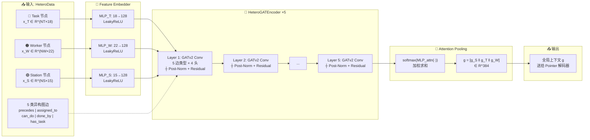
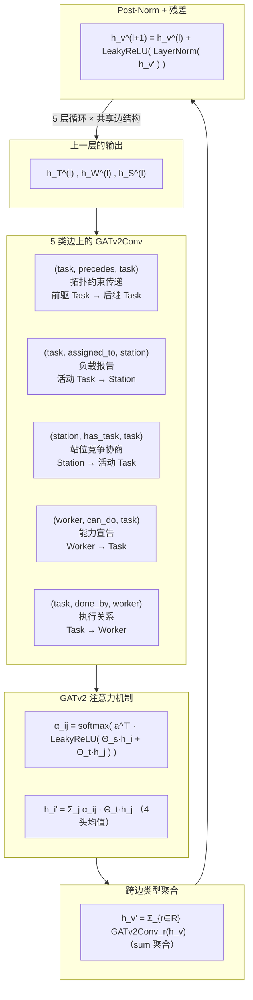
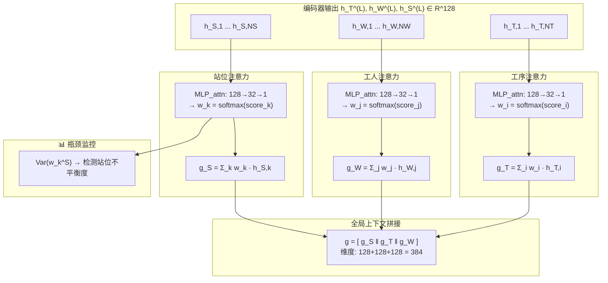
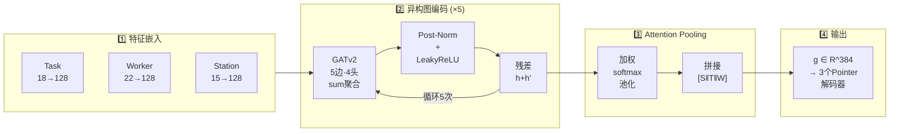

# 异构图编码器 + 上下文感知池化（PPT 用 Mermaid 图）

## 方案 A：横向总览流水线（推荐 PPT 用）

---

## 方案 B：单层 GATv2 消息传递展开（适合讲解图卷积细节）

---

## 方案 C：Attention Pooling 展开（适合讲解全局上下文生成原理）

---

## 方案 D：紧凑单图版（适合一页 PPT 放完整 Encoder 全貌）

---

## 推荐组合

| PPT 页面 | 使用方案 | 要点 |
|:---:|:---:|------|
| **第 1 页**（总览） | 方案 A 或 D | 展示从异构输入到全局上下文的完整数据流 |
| **第 2 页**（细节） | 方案 B | 展开 GATv2 单层的消息传递机制 + 公式 |
| **第 3 页**（池化） | 方案 C | 重点讲解 Attention Pooling 如何加权融合三类节点 |

> **渲染提示**: 复制对应方案代码到 [Mermaid Live Editor](https://mermaid.live) 可实时预览并导出 SVG/PNG。GitHub、Typora、VS Code（安装 Markdown Preview Mermaid 插件）均原生支持渲染。
