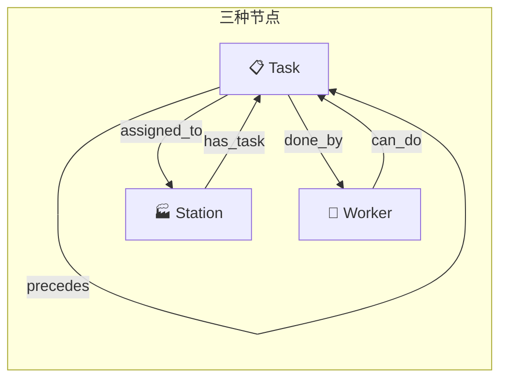

# HB-GAT-PN 异构图构建详解

> **模型全称**: Heterogeneous Graph Attention Pointer Network  
> **应用场景**: 飞机脉动装配线（APAL）智能调度  
> **核心文件**: `models/hb_gat_pn.py`, `environment.py`, `utils/gpu_graph_manager.py`

---

## 1. 图定义

异构图 $\mathcal{G} = (\mathcal{V}, \mathcal{E})$，包含三种节点、五类边关系：

### 1.1 节点类型

| 节点类型 | 数量 | 含义 | 特征维度 |
|:---:|:---:|------|:---:|
| **Task** | $N_T$ | 装配工序（含 Root/Sub 虚拟节点 + 真实工序） | $d_T = 18$ |
| **Worker** | $N_W$ | 工人 | $d_W = 22$ |
| **Station** | $N_S$ | 装配站位（物理工位） | $d_S = 15$ |

> **说明**: Root 和 Sub 是虚拟节点，工时为 0、需求人数为 0，仅起拓扑组织作用；只有 Task 类型的叶子节点是真实可调度工序。

### 1.2 边关系

| 边类型 `(src, rel, dst)` | 方向 | 语义 | 来源 |
|:---|:---|------|------|
| `(task, precedes, task)` | Task → Task | 工序优先级约束（DAG） | `data_loader.py` 的 5 条 Rule 构建，**静态** |
| `(task, assigned_to, station)` | Task → Station | 工序已分配到某站位 | 仿真每步动态写入，**动态** |
| `(station, has_task, task)` | Station → Task | assigned_to 的逆边 | 自动生成，**动态** |
| `(worker, can_do, task)` | Worker → Task | 工人技能覆盖该工序 | 工人技能矩阵 × 工序技能类型，**静态** |
| `(task, done_by, worker)` | Task → Worker | 工人正在执行该工序 | 仿真每步动态写入，**动态** |

边关系图：



---

## 2. 节点特征详细构成

### 2.1 Task 节点特征 $\mathbf{x}_T \in \mathbb{R}^{18}$

| 索引 | 特征 | 公式/含义 | 类型 |
|:---:|------|-----------|:---:|
| 0 | $\tilde{d}_i$ | $\tilde{d}_i = d_i / T_{base}$，归一化工时 | 静态 |
| 1–4 | $\mathbf{s}_i$ | 工序状态 One-Hot：`[Pending, Ready, InProgress, Completed]` | 动态 |
| 5–14 | $\mathbf{c}_i$ | 所需技能类型 One-Hot（共 10 种工种） | 静态 |
| 15 | $\mathbb{I}[i \in \text{CP}]$ | 是否在关键路径上（CPM 算法预计算） | 静态 |
| 16 | $r_i$ | 需求工人数（$\geq 1$） | 静态 |
| 17 | — | $\log(1 + w_i / T_{base})$，物料等待时间（对数归一化） | 动态 |

> $T_{base} = \frac{1}{|\{i: d_i > 0\}|} \sum_{i: d_i > 0} d_i$，为所有非零工时工序的平均工时。

### 2.2 Worker 节点特征 $\mathbf{x}_W \in \mathbb{R}^{22}$

| 索引 | 特征 | 公式/含义 | 类型 |
|:---:|------|-----------|:---:|
| 0 | $\eta_j$ | 工人效率系数（$\leq 1.0$） | 静态 |
| 1–10 | $\mathbf{m}_j$ | 技能矩阵 One-Hot（10 种技能） | 静态 |
| 11 | — | $\log(1 + w_j / T_{base})$，工人空闲等待时间 | 动态 |
| 12 | $\mathbb{I}[\text{is\_free}]$ | 是否空闲（0/1） | 动态 |
| 13–20 | $\mathbf{l}_j$ | 绑定站位 One-Hot：`[0:未绑定, 1~7: 站位编号]` | 动态 |
| 21 | $f_j$ | 疲劳系数 | 动态 |

**疲劳系数**计算公式：

$$f_j = \text{clamp}\left(1 - \eta_{decay} \cdot \frac{\max(0, W_j^{\text{cum}} - W_{th})}{2 W_{th}},\; f_{min}\right)$$

其中 $W_j^{\text{cum}}$ 为工人累计工时，$W_{th}$ 为疲劳阈值。

### 2.3 Station 节点特征 $\mathbf{x}_S \in \mathbb{R}^{15}$

| 索引 | 特征 | 公式/含义 | 类型 |
|:---:|------|-----------|:---:|
| 0 | $L_k / \tilde{L}$ | 归一化当前负载（$\tilde{L}$ 为理想站位负载） | 动态 |
| 1 | $C_k / N_W$ | 绑定到该站位的工人占比 | 动态 |
| 2 | $M / N_W$ | 未绑定（可流动）工人占比 | 动态 |
| 3 | $C_k^{free} / N_W$ | 已绑定且当前空闲的工人占比 | 动态 |
| 4 | — | $\log(1 + \tau_k / T_{base})$，槽位释放等待时间（对数归一化） | 动态 |
| 5 | $L_k / \sum_s L_s$ | 相对负载占比（全局竞争视角） | 动态 |
| 6 | $L_k / \max_s L_s$ | 最大相对负载比 | 动态 |
| 7 | $U_k / S_{max}$ | 槽位利用率（$S_{max}=3$） | 动态 |
| 8–14 | — | 预留字段（零填充） | — |

> $\tilde{L} = \frac{\sum_i d_i \cdot r_i}{N_S}$，为总工作量在站位间的理想平均值。

---

## 3. 特征嵌入（Feature Embedder）

每种节点的原始特征通过**独立的单层 MLP** 投影到统一隐藏维度 $H = 128$：

$$\boxed{\mathbf{h}_T^{(0)} = \text{LeakyReLU}\big(\text{LayerNorm}(\mathbf{W}_T \mathbf{x}_T + \mathbf{b}_T)\big)}$$

$$\boxed{\mathbf{h}_W^{(0)} = \text{LeakyReLU}\big(\text{LayerNorm}(\mathbf{W}_W \mathbf{x}_W + \mathbf{b}_W)\big)}$$

$$\boxed{\mathbf{h}_S^{(0)} = \text{LeakyReLU}\big(\text{LayerNorm}(\mathbf{W}_S \mathbf{x}_S + \mathbf{b}_S)\big)}$$

其中参数矩阵维度：
- $\mathbf{W}_T \in \mathbb{R}^{128 \times 18}$, $\mathbf{b}_T \in \mathbb{R}^{128}$
- $\mathbf{W}_W \in \mathbb{R}^{128 \times 22}$, $\mathbf{b}_W \in \mathbb{R}^{128}$
- $\mathbf{W}_S \in \mathbb{R}^{128 \times 15}$, $\mathbf{b}_S \in \mathbb{R}^{128}$

> 当前配置 `use_layer_norm = False`，故 `LayerNorm` 退化为恒等映射。

---

## 4. 异构图注意力编码器（HeteroGATEncoder）

共 $L = 5$ 层 GATv2，每层 $K = 4$ 个注意力头（取均值 $\text{concat=False}$）。

### 4.1 GATv2 单头注意力

对每种边类型 $(src, rel, dst)$ 定义一个独立的 `GATv2Conv`：

**注意力系数**（GATv2 使用目标节点变换 $\mathbf{\Theta}_t$ 而非源节点 $\mathbf{\Theta}_s$ 作为 Query）：

$$e(\mathbf{h}_i, \mathbf{h}_j) = \mathbf{a}^\top \cdot \text{LeakyReLU}\big(\mathbf{\Theta}_s \mathbf{h}_i + \mathbf{\Theta}_t \mathbf{h}_j\big)$$

$$\alpha_{ij} = \text{softmax}_j\big(e(\mathbf{h}_i, \mathbf{h}_j)\big) = \frac{\exp(e(\mathbf{h}_i, \mathbf{h}_j))}{\sum_{k \in \mathcal{N}(i)} \exp(e(\mathbf{h}_i, \mathbf{h}_k))}$$

**多头均值聚合**：

$$\mathbf{h}_i' = \frac{1}{K} \sum_{k=1}^{K} \sum_{j \in \mathcal{N}(i)} \alpha_{ij}^{(k)} \cdot \mathbf{\Theta}_t^{(k)} \mathbf{h}_j$$

其中 $\mathbf{a} \in \mathbb{R}^{2H}$，$\mathbf{\Theta}_s, \mathbf{\Theta}_t \in \mathbb{R}^{H \times H}$。

> **GATv2 vs 原始 GAT**: GATv2 的关键改进在于 $e(\mathbf{h}_i, \mathbf{h}_j)$ 中 $\mathbf{\Theta}_s$ 和 $\mathbf{\Theta}_t$ 是分开作用后再相加，而非 GAT 的拼接形式 $[\mathbf{\Theta}\mathbf{h}_i \| \mathbf{\Theta}\mathbf{h}_j]$，这使得注意力排序是**动态的**（不同目标节点的注意力排序可以不同），表达能力更强。

### 4.2 异构图消息聚合

同一节点可能接收来自多种边类型的消息，用 **sum** 进行跨类型聚合：

$$\mathbf{h}_v^{(l+1)} = \sum_{r \in \mathcal{R}_{in}(v)} \left( \text{GATv2Conv}_r^{(l)}\big(\mathbf{h}^{(l)}, \mathcal{E}_r\big) \right)_v$$

### 4.3 残差连接 + Post-Norm

每层输出经过 LayerNorm 后再进行残差连接：

$$\boxed{\mathbf{h}_v^{(l+1)} = \mathbf{h}_v^{(l)} + \text{LeakyReLU}\big(\text{LayerNorm}(\mathbf{h}_v')\big)}$$

> **重要细节**: `HeteroConv` 只返回作为边**终点**的节点更新。未出现在任何边终点中的节点（如孤立 Worker），通过恒等映射保留：$\mathbf{h}_v^{(l+1)} = \mathbf{h}_v^{(l)}$。

### 4.4 五条边对应的消息传递

| 边类型 | 消息流 | 物理含义 |
|:---|:---|------|
| `(task, precedes, task)` | 前驱 Task → 后继 Task | 拓扑约束传递：告知后继"前面还有多少工作" |
| `(task, assigned_to, station)` | 活动 Task → Station | 负载报告：告知站位"我正在占用你的槽位" |
| `(station, has_task, task)` | Station → 活动 Task | 站位协商：告知任务"站位的资源竞争状态" |
| `(worker, can_do, task)` | Worker → Task | 能力宣告：告知任务"我能帮你做" |
| `(task, done_by, worker)` | Task → Worker | 执行关系：告知工人"你的技能正在被使用" |

---

## 5. 全局上下文池化（Attention Pooling）

编码器输出的节点嵌入 $\mathbf{h}_T^{(L)}, \mathbf{h}_W^{(L)}, \mathbf{h}_S^{(L)}$ 通过 Attention Pooling 聚合成全局上下文向量 $\mathbf{g}$。

**站位注意力权重**：

$$w_k^S = \frac{\exp(\text{MLP}_{attn}^S(\mathbf{h}_{S,k}))}{\sum_j \exp(\text{MLP}_{attn}^S(\mathbf{h}_{S,j}))}, \quad \mathbf{g}_S = \sum_{k} w_k^S \cdot \mathbf{h}_{S,k}$$

**工序注意力权重**（同理）：

$$w_i^T = \frac{\exp(\text{MLP}_{attn}^T(\mathbf{h}_{T,i}))}{\sum_j \exp(\text{MLP}_{attn}^T(\mathbf{h}_{T,j}))}, \quad \mathbf{g}_T = \sum_{i} w_i^T \cdot \mathbf{h}_{T,i}$$

**工人注意力权重**（同理，得到 $\mathbf{g}_W$）

**全局上下文拼接**：

$$\boxed{\mathbf{g} = [\mathbf{g}_S \| \mathbf{g}_T \| \mathbf{g}_W] \in \mathbb{R}^{3H = 384}}$$

> **物理含义**: 站位注意力权重 $w_k^S$ 的方差 $\text{Var}(w_k^S)$ 被用于监控——训练过程中若某个站位持续获得极高关注度，说明该站位是系统瓶颈。

---

## 6. 完整数据流总结

```
┌──────────────────────────────────────────────────────┐
│  Step 1: 离线数据加载 (data_loader.py)                │
│  ──────────────────────────────────────────────────   │
│  CSV → 启发式层级判定 (Root/Sub/Task)                  │
│     → 5 Rule 构建 precedence DAG                     │
│     → 输出: precedence_edges [2, E]                   │
└──────────────────────┬───────────────────────────────┘
                       ▼
┌──────────────────────────────────────────────────────┐
│  Step 2: 仿真环境初始化 (environment.py)              │
│  ──────────────────────────────────────────────────   │
│  构造 HeteroData:                                     │
│    task.x   [N_T, 18]   静态 + 动态特征                │
│    worker.x [N_W, 22]   静态 + 动态特征                │
│    station.x [N_S, 15]  动态特征                       │
│  构建边字典:                                          │
│    (task, precedes, task)        静态 DAG             │
│    (worker, can_do, task)        技能矩阵             │
│    (task, assigned_to, station)  初始为空              │
│    (task, done_by, worker)       初始为空              │
└──────────────────────┬───────────────────────────────┘
                       ▼
┌──────────────────────────────────────────────────────┐
│  Step 3: 每步动态更新 (gpu_graph_manager.py)          │
│  ──────────────────────────────────────────────────   │
│  批量原地覆写:                                        │
│    task.x[:, 1:5]     ←  工序状态 One-Hot              │
│    task.x[:, 17]      ←  物料等待时间                  │
│    worker.x[:, 11:13] ←  空闲/等待特征                 │
│    worker.x[:, 13:21] ←  绑定站位 One-Hot              │
│    worker.x[:, 21]    ←  疲劳系数                      │
│    station.x[:, 0:8]  ←  负载/槽位/工人分布            │
│  动态边填充:                                          │
│    (task, assigned_to, station)  ← 活动工序            │
│    (task, done_by, worker)       ← 执行关系            │
└──────────────────────┬───────────────────────────────┘
                       ▼
┌──────────────────────────────────────────────────────┐
│  Step 4: GNN 编码 (hb_gat_pn.py)                      │
│  ──────────────────────────────────────────────────   │
│  FeatureEmbedder:   x ∈ R^d  →  h^(0) ∈ R^128        │
│  HeteroGATEncoder ×5:  异构图消息传递                 │
│    (GATv2 + 残差 + Post-Norm)                         │
│  Attention Pooling:   h^(L) → g ∈ R^384              │
└──────────────────────┬───────────────────────────────┘
                       ▼
┌──────────────────────────────────────────────────────┐
│  Step 5: 解码预测 (3 个 Pointer Head)                  │
│  ──────────────────────────────────────────────────   │
│  TaskPointer:     g + task_embs   → 选工序             │
│  StationSelector: 选中Task + station_embs → 选站位     │
│  WorkerPointer:   选中Task + worker_embs → 选工人      │
│    (自回归循环选择 + Stop Head 决定停止)               │
└──────────────────────────────────────────────────────┘
```

---

## 7. 关键超参数

| 参数 | 值 | 含义 |
|------|:---:|------|
| `hidden_dim` | 128 | 隐藏层统一维度 |
| `num_gat_layers` | 5 | 图注意力编码层数 |
| `num_heads` | 4 | 多头注意力头数 |
| `task_feat_dim` | 18 | Task 节点输入特征维度 |
| `worker_feat_dim` | 22 | Worker 节点输入特征维度 |
| `station_feat_dim` | 15 | Station 节点输入特征维度 |
| `use_leaky_relu` | True | 激活函数选择（防 ReLU 死亡） |
| `use_layer_norm` | False | 编码器中是否使用 LayerNorm |
| `aggr` | sum | 跨边类型消息聚合方式 |
| `concat` | False | GATv2 多头输出取均值而非拼接 |
| `add_self_loops` | False | GATv2 不自环（避免信息泄露） |
